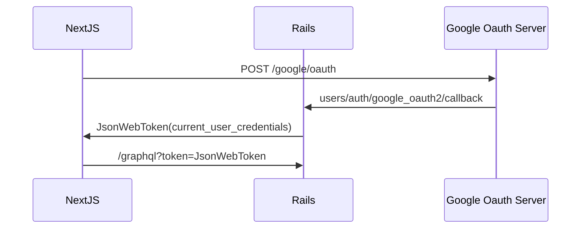

# NextJS w/ Rails omniauth demo

# Getting started
- `cd backend && bundle && rails s`
- `cd frontend && yar install && yarn dev`
- `yarn run codegen` (if you want to generate types)
### Set secrets
- Set omniauth secret key. https://github.com/cody-elhard/nextjs-rails-omniauth-demo/blob/main/backend/config/initializers/devise.rb#L274
- Set google client_id. https://github.com/cody-elhard/nextjs-rails-omniauth-demo/blob/main/frontend/pages/sign_in/index.tsx#L9
