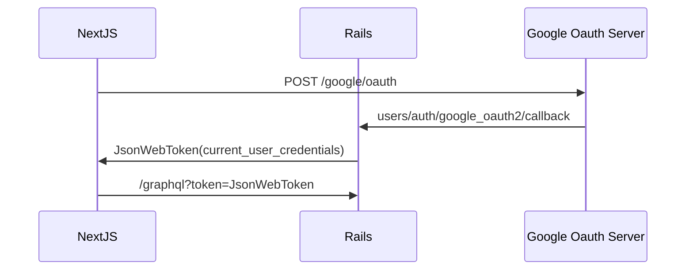

# NextJS w/ Rails omniauth demo

# Getting started
- `cd backend && bundle && rails s`
- `cd frontend && yar install && yarn dev`
- `yarn run codegen` (if you want to generate types)
### Set secrets (setup google oauth2 client credentials, https://developers.google.com/identity/protocols/oauth2)
- Set google secret key. https://github.com/cody-elhard/nextjs-rails-omniauth-demo/blob/main/backend/config/initializers/devise.rb#L274
- Set google client_id. https://github.com/cody-elhard/nextjs-rails-omniauth-demo/blob/main/frontend/pages/sign_in/index.tsx#L9

https://user-images.githubusercontent.com/32208000/214193063-84188280-b67f-4ce8-b5b2-b4c01e2dc273.mov

 
 
 
 
 
 
 
 
 
 
 
 
 
 
 
 

### Donations
[Venmo @Cody-Elhard](https://account.venmo.com/u/Cody-Elhard)
- If this saved you time, cast your vote that you would like more helpful projects in the future.
